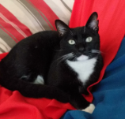

## Repositório TCC - Detecção de Fraudes Bancárias

### Olá! 👋

Me chamo Amanda e estou compartilhando aqui o repositório de códigos e arquivos utilizados no meu TCC sobre Detecção de Fraudes Bancárias. Esse trabalho faz parte do **MBA em Data & Analytics - USP Pecege**, onde estou utilizando técnicas avançadas de Ciências de Dados para estudar e implementar modelos preditivos que ajudem a detectar fraudes no setor bancário.

Sou formada em Física pela UNICAMP e atualmente curso o **8º semestre de Ciência de Dados na UNIVESP**, além do MBA. Minha experiência inclui 8 anos como Metrologista no CPQD e atualmente trabalho como Engenheira de Dados em Gestão ESG no Itaú Unibanco, onde desenvolvo soluções automatizadas para análise de grandes volumes de dados, construção de dashboards e pipelines de dados para tomada de decisões estratégicas.

Além do meu foco em tecnologia, também sou mãe do Tito, meu gatinho, que sempre me acompanha nas horas de trabalho! 🐱

### Objetivo deste Repositório

💬 Este repositório foi criado para armazenar e compartilhar os **análises**, **códigos** e **conteúdos complementares** que estou utilizando no desenvolvimento do meu TCC. O objetivo central do trabalho é a detecção de fraudes financeiras, utilizando técnicas como **Árvores de Decisão** e **Random Forest**, com a intenção de identificar padrões e comportamentos suspeitos em grandes volumes de transações bancárias.

O repositório contém scripts de tratamento de dados, implementação de modelos de machine learning, e documentação das análises realizadas ao longo do projeto.

### Tecnologias Utilizadas:
- Python (pandas, scikit-learn, matplotlib, etc.)
- GIT para controle de versão e colaboração
- Técnicas de Machine Learning (Árvores de Decisão, Random Forest)
- Tratamento de dados e visualização

✨ Abaixo estão os links para as pastas organizadas por sprint, com todos os conteúdos e análises desenvolvidas até o momento:

## CONTEÚDOS

Aqui estão os links das atividades e códigos de cada sprint do projeto de TCC.

### Sprints e Códigos

- **Tratamento de Dados (incluindo o Pré-processamento de Dados, Modelagem Preliminar Otimização de Modelos):**  
  [Códigos Desenvolvidos em Python](https://github.com/amanda8792/curso_compass/tree/master/SPRINT%2001)
  
### Documentação sobre Fraudes Financeiras

- **Bibliografias sobre técnicas de detecção de fraudes e arquivos relacionados: **  
  [Link para os arquivos](https://github.com/amanda8792/)

Este repositório será atualizado ao longo do desenvolvimento do TCC, então fique à vontade para explorar os códigos, fazer sugestões e contribuir! 👩‍💻
